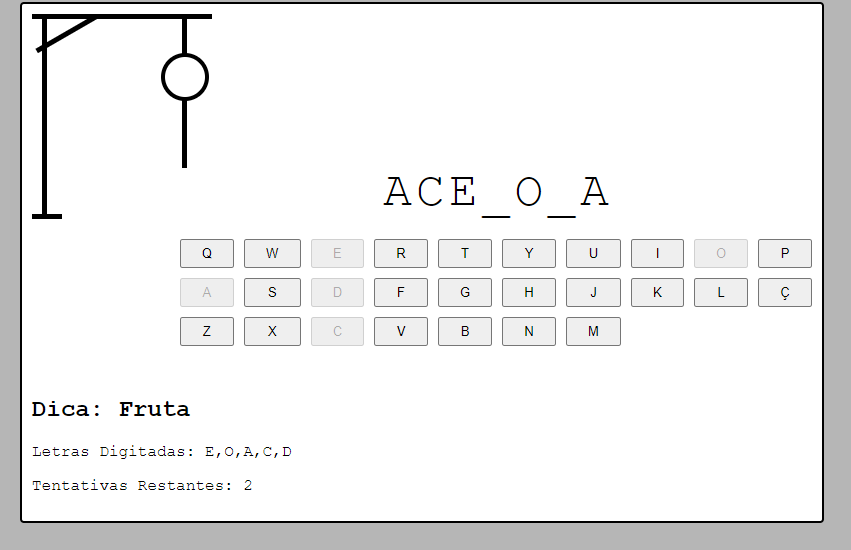

# Jogo da Forca em HTML, CSS e JavaScript

Bem-vindo ao Jogo da Forca, uma implementação simples usando tecnologias web básicas: CSS, HTML e JavaScript. Este projeto foi desenvolvido como uma atividade para praticar conceitos fundamentais de programação front-end.

## Como Jogar

1. Abra o arquivo `index.html` no seu navegador web.
2. O jogo começará quando escolher um nivel de dificuldade.
3. A palavra a ser adivinhada será exibida com underscores representando as letras desconhecidas.
4. Clique nas letras para tentar adivinhar a palavra.
5. Cada letra correta revelará sua posição na palavra.
6. Se você errar várias vezes, o personagem da forca será desenhado progressivamente.
7. O objetivo é adivinhar a palavra antes que o personagem da forca seja totalmente desenhado.

## Estrutura do Projeto

- **index.html**: Contém a estrutura HTML do jogo.
- **style.css**: Define o estilo e a aparência do jogo.
- **main.js**: Implementa a lógica do jogo usando JavaScript.

## Personalização

Sinta-se à vontade para explorar e personalizar o código-fonte conforme suas preferências. Adicione novas palavras, ajuste o estilo ou expanda as funcionalidades do jogo.

## Contribuição

Contribuições são bem-vindas! Se você encontrar problemas, bugs ou tiver ideias para melhorar o jogo, por favor, abra uma issue ou envie uma pull request.

Divirta-se jogando o Jogo da Forca!

